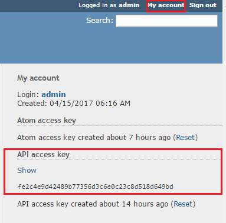
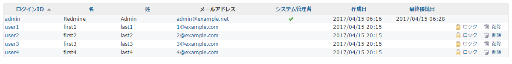

# RedmineUserImport

Create user from csv file usig by [Redmine REST API](//www.redmine.org/projects/redmine/wiki/Rest_Users).

# Requirements

* .NET Framework higher than 4.5
* Windows (Latest [CsvHelper](//github.com/JoshClose/CsvHelper) may be can not support mono.)  

# Download

Please download [here](//github.com/YoshinoriN/RedmineUserImport/releases).

# CSV

This program create users from csv. CSV is no need header.

* First colume is user's ID.
* Second colume is user's Password.
* Third colume is user's FirstName.
* Fourth colume is user's LastName.
* Fifth colume is user's Email Address.
* Sixth colume is specify force change password when user login at the first time. (true or false) 

CSV example is below.

```csv
user1,pass1111,firstName1,last1,1@example.com,true
user2,pass1112,firstName2,last2,2@example.com,true
user3,pass1113,firstName3,last3,3@example.com,false
```

# Characterset

I confirmed only UTF-8. (CSV and database)

# Execute

Please execute `RedmineUserImport.exe` with arguments. Arguments must be separated by spaces.


## arguments

|Property|Argument number|Value|
|---|---|---|
|Redmine URL|1|Your Redmien URL. Need `http://` or `https://` prefix.|
|API Key|2|Redmine API Key. (Need administrator's API Key)|
|CSV file's path|3|CSV file's path.|
|API execution span|4|This argument is optional. Specify the execution span of the API (sec). Default is zero.|

Below is example.

`RedmineUserImport.exe http://localhost:3000 fe2c4e9d42489b77356d3c6e0c23c8d518d649bd  ./users.csv 5`

# API Key

You have to use administrator's API Key.
You can confirm your API Key below. 



# Confirm

After execute, please confirm Redmine's users console.



# Log

Log will be created `create.log`.
Example is below.

```txt
[INFO] 2017/04/16 5:15:45 Start.
Success: 1@example.com
Success: 2@example.com
Success: 3@example.com
Faild: 1@example.com {"errors":["Email has already been taken","Login has already been taken"]}
Success: 4@example.com
[INFO] 2017/04/16 5:16:03 Finish.
```

# License

* [The MIT License (MIT)](LICENSE)

# Use Libralies and License

Thanks you for a wouderfule library.

## [Newtonsoft.Json](//github.com/JamesNK/Newtonsoft.Json)

> The MIT License (MIT)
>
> Copyright (c) 2007 James Newton-King

* [Full license text](/licenses/Newtonsoft.Json.txt) 

## [CsvHelper](//github.com/JoshClose/CsvHelper)

> MS-PL and Apache 2.0
>
> Copyright (c) JoshClose

* [Full license text](/licenses/CsvHelper.txt)
